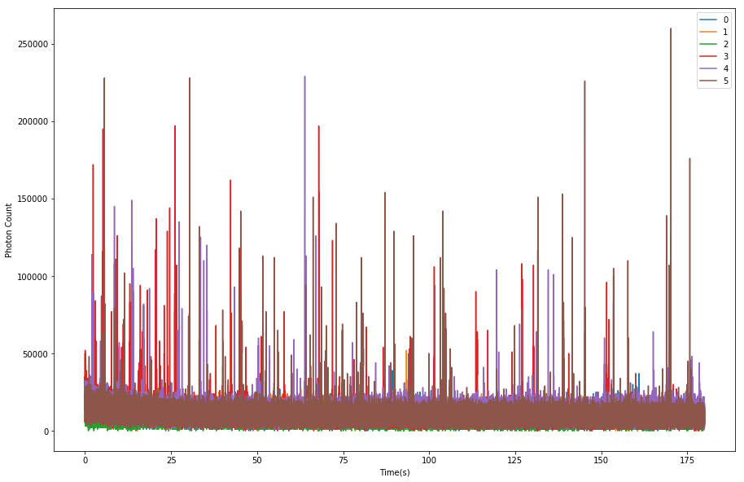

# Peak Counting Spectroscopy (PeCoS)
PeCoS helps the analysis of low abundance protein using a conventional Fluorescence Correlation Spectroscopy (FCS) setup. There are two python scripts in the folder, namely parse_fcs.py and thresh_fcs.py. parse_fcs.py parses through files with .fcs extension and combines them into one file with .csv extension. thresh_fcs.py finds the threshold from the aforementioned file with .csv extension and obtains the number of peak count using the threshold.

An example of .fcs file format:

  
(Courtesy of Thomas Steinacker)  

Plotting it into a spectrum will look like this:  
  

## Getting Started

These instructions will get you a copy of the project up and running on your local machine for development and testing purposes. It was developed in macOS Sierra Version 10.12.6 but similar logic may well apply to other systems.

### Prerequisite

Please install anaconda python 2.7 version from [anaconda website](https://www.anaconda.com/download/#macos)

### Installing

Once anaconda is up and running. Please download **environment.yml** from installation folder. Place the file on your Desktop. environment.yml contains all required library for scripts.

Open terminal and type:
```
cd Desktop
```
Press **Enter** on your keyboard. Then type:  
```
conda env create -f environment.yml
```
Press **Enter**. Please wait patiently.  

The required environment is up and running.

## Running and tests

### Download the example files
From Demo folder in this repository download A_01.fcs, A_02.fcs, A_03.fcs, B_01.fcs, B_02.fcs, and B_03.fcs. Save them on the Desktop. Create a new folder called Demo. Place them in Demo folder of your local machine.

.fcs files were orginally obtained from Thomas Steinacker in the ZenBlack software using a Zeiss880 Airy Scan confocal setup.

Assming your terminal is still open and your current directory is Desktop. Type:  
```
git clone https://github.com/SiuShingWong/FCS-for-low-abundance-protein.git
```

### Running and testing the program
Close all terminal windows. Open terminal again and type:  
```
cd Desktop/FCS-for-low-abundance-protein
```
Press **Enter** Then type:  
```
source activate CV
```
Press **Enter** Then type:  
```
python parse_fcs.py "/Users/your_user_name_of_computer/Desktop/Demo" 1
```
python parse_fcs.py calls the program. "/Users/your_user_name_of_computer/Desktop/Demo" specifies where the .fcs files are located. 1 specifies the number of recordings per .fcs file. The program will generate a data.csv file in the same directory as the .fcs files, in our case within the Demo folder.  
  
To calculate the threshold of the control recordings, subtract it from the samples, and count the number of peaks for each recordings, we can run the following command in the same terminal:  
```
python thresh_fcs.py "/Users/your_user_name_of_computer/Desktop/Demo" 3 8
```
"/Users/your_user_name_of_computer/Desktop/Demo" specifies where the data.csv file was generated from the previous program. 3 specifies the number of control recordings used in this folder.  8 specifies the number of standard deviations away from the mean that are additionally subtracted. The program would create a folder called "Results" in Demo folder. In the results folder, raw_data(thresh-mean+8.0sd).csv and peak_count(thresh-mean+8.0sd).csv are generated. The former contains the data subtracted by the threshold. The later counts the number of peaks after thresholding. The number of peaks is counted after thresholding including a continuous width of peak or a single peak.  

If users want to generate various standard deviation-based thresholded files, they can type in the same terminal:  
```
python thresh_fcs.py "/Users/your_user_name_of_computer/Desktop/Demo" 3 "1 2 3 4 5 8"
```
The program now will produce multiple raw_data(...).csv and peak_count(...).csv with their corresponding standard deviations.  


### Advanced usage and caution
- Ensure that the number of control recording is right. If there are 2 control .fcs files and each file contains 3 recordings, the total number should be 3*2 = 6. 
- Ensure that all .fcs file in the same directory should have the same number of recordings per file.
- Ensure that the name of the control should be smaller than all other .fcs folder. In our case, A is always smaller than B, which determins the A series as our control.

### Authors
**Isaac Wong** @ Raff Lab  
email: isaacwongsiushing@gmail.com

## Acknowledgements
- Thomas Steinacker for kickstarting the project and providing the theoretical perspectives of FCS
- Everyone from Raff Lab
- Sir William Dunn School of Pathology
- Balliol College
- Clarendon Fund
- Cancer Research UK

## License
This project is licensed under GNU GENERAL PUBLIC LICENSE